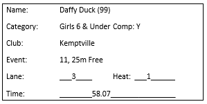

# Points Table

<!-- TOC -->

- 1. Introduction
- 2. Dependencies
- 3. Tenets of Points Table System
- 4. Constraints
- 5. Points Table Files
- 6. Week Before the Meet
- 7. Results for Parents and Swimmers at the Meet
- 8. Data Entry User Manual
    - 8.1. Start the Data Entry Application
    - 8.2. Events Mode
    - 8.3. Disqualification or Did-Not-Finish
    - 8.4. Generate Results
    - 8.5. Entering Relay Results
    - 8.6. Medley Relays
    - 8.7. Updating and/or Entering Swimmers for Clubs
    - 8.8. Changing Swimmer Information
    - 8.9. Update or Delete a Result Already Entered
- 9. Generate Participation Labels
- 10. Print Results for the Meet Announcer
- 11. Enhancements and Fixes

<!-- /TOC -->

## 1. Introduction

Points Table is a suite of tools to automate calculating results at a swim meet. The suite includes a tool to generate labels for participation ribbons. The labels list the events a swimmer entered and the time recorded for each event.

Features of Points Table include:

- speedy data entry of the information from time cards into a computer
- calculation of event finishers
- calculation of medal winners for each category
- calculation of team placement
- generation of printouts for announcer to read at the completion of the meet
- generation of participation labels for each swimmer
- HTML-formatted results for real-time presentation by a web server

## 2. Dependencies

- Python 3 to run Points Table
- Microsoft Office Word to print participation labels with results for each swimmer

## 3. Tenets of Points Table System

1. Let technology do the math.
2. Let technology automate steps.
3. Share results with all participants.
4. Let attendees see results in real time.
5. Assign a unique number to each swimmer to speed data entry.

## 4. Constraints

1. Points Table calculates participating team results on a points-per-swimmer calculation and does not apply a minimum number-of-swimmers rule. Possibly, a small swim team of two swimmers could have the highest points-per-swimmer value. The swim meet manager should review the club results at the end of the meet and look for any unfair results, applying a minimum-number-of-swimmers rule if necessary.
2. Points Table supports competitive swimmers that want to swim in their own age category as well as in the Open category. If the swim meet manager wants all competitive swimmers in the Open category, visiting coaches must ensure that none of their competitive swimmers are in the non-competitive events.

## 5. Points Table Files

Filename | Purpose
------ | ------
enter_results.py   | Application through which you enter results from time cards
filemgr.py | Library for configuration file reading
ms2.py | Application that calculate results and formats files for meet announcer
ms.conf | Configurable settings for Points Table
clubs.csv | List of swim teams that might attend the swim meet
categories.csv | List of gender and age groupings
events.csv | List of events and descriptions for the swim meet
medals.csv | List of medals to be awarded by category
swimmers.csv | List of swimmers and relay teams attending the swim meet
records*.csv | Unprocessed results from time cards
swimmers_results.txt | Summary by swimmer of events, times, placements
event_results.txt | Summary by event of swimmers, times, placements
medal_results.txt | Medal winners by gender and age category
club_results.txt | Summary by club of points per club
mklabels.vbs | Visual Basic script that constructs participation labels
labels-input.txt | Label summary data used to generate Word document for printing
Labels-Print.docx | Word document populated by mklabels.vbs to generate file for printing
orange-500.gif | Background image for Points Table
participantsV3.xlsx | Macro-enabled Excel spreadsheet to collect participating swimmers from each club in advance of the swim meet
instructions.docx | Instructions for swim team coach on how to use participantsV3.xlsx and what to do with the artifacts produced by the spreadsheet
Slips-Template.docx | Template Word document for time card slips generation
Slips-Print.docx | Ready-to-print Word document with time cards for team

## 6. Week Before the Meet

As noted by one of the tenets, we want data entry to be as fast as possible when time cards arrive at the points table. A drop-down swimmers list works but is slow. We have found that having a swimmer number on each time card allows us to have Points Table quickly load details of the swimmer from that number and leave just the event information for data entry thereafter. To this end, the week before the swim meet, we collect lists of swimmers from each participating team. We provide each swim team coach with an Excel spreadsheet ```participantsV3.xlsx``` and instructions (```instructions.docx``` as an email message). As the coach enters swimmers attending the swim meet, the Excel spreadsheet adds a unique swimmer number. As a thank-you for providing us back the list of swimmers, the Excel spreadsheet creates timecards with ```Slips-Template.docx``` and ```Slips-Print.docx``` that the coach can print off and cut up, eliminating the tedious task of handwriting the time cards.
***
**_NOTE:_**

  We had mixed results with this process. We found that many coaches are unfamiliar with Excel. Allow lots of time to send out an email with the Excel spreadsheet and instructions so that you can collect the CSV files emailed back.

***
A concatenation of all the CSV files returned for the attending clubs is the ```swimmers.csv``` file for the day of the meet.

## 7. Results for Parents and Swimmers at the Meet

Points Table generates a simple HTML-formatted file of event results. In past meets, a Raspberry Pi running Apache web server has allowed parents and swimmers to see event results as soon as the meet statistics program does its calculation. An entry in ```ms.conf``` allows you to specify the drive, path, and filename where meet statistics places the HTML-formatted results (e.g., ```ppt_monitor_file=D:\index.html```). Sharing the folder gives the Raspberry Pi access to the file for presentation by Apache. This readme has no instructions for setting up the Raspberry Pi or a web server: the internet describes these steps in detail.

Here is a partial example of how the web page renders. Note that the results are in reverse order, most recent at the top.


## 8. Data Entry User Manual

### 8.1. Start the Data Entry Application

From a command prompt, start the ```enter_results.py``` script.


The default entry mode on startup is ```Events```. You can change to ```Free Relays``` and ```Clubs``` with the drop down in the top, right corner.


### 8.2. Events Mode

You use the ```Events``` mode for most of the meet. In this mode, you enter the results from time cards. Assume that event #11, Girls 6 & Under, 25m Free has just finished. You get the time cards from the first heat. The first time card is for Daffy Duck.



Click on the drop down to the right of ```Event``` (shows  by default), move the cursor and select ```11,Girls 6 & Under,25m Free```.


Alternatively, to select the event from the numeric keyboard, tab to the window on the right side of the ```Event``` drop down, enter "11", and press ```Enter```. Case insensitive for events "AA" and "BB": "aa" or "Aa" or "aA" or "AA" are equivalent.


The event window shows event 11 and the cursor is positioned over the ```Swimmer Number``` data entry window.


Enter the swimmer number from the time card, ```99``` for Daffy Duck and press ```Enter```. The program looks up swimmer #99 in the swimmers database and populates the swimmer information in the bottom portion of the data entry console. The program repositions the cursor to the ```Lane``` data entry window.


Enter the lane, heat, and time from the time card. Enter ```0``` for the minutes. When you have entered the data, you see a completed console snippet like the following example.


You can press ```Enter``` or move the cursor to the ```Save Entry``` button and press it. A successful save results in a pop-up message.


Select ```OK``` on the pop-up message. The data entry fields clear and the cursor repositions to the data entry window for ```Swimmer Number```. This action readies you to enter the results from the next time card for event #11. Do that a few hundred times more and you will have a set of raw results ready for compilation into the final results.

### 8.3. Disqualification or Did-Not-Finish

You may get a time card with a "DNF" or "DQ" written on it. You should still record the results for completeness so the swimmer has a complete history of events and times on the participation label. In this situation, use the ```OK``` drop down list and select ```DQ``` or ```DNF``` per the time card.


### 8.4. Generate Results

After entering the time cards for an event, press the ```Generate Results``` button. The Points Table data entry program calls the Python ```ms2.py``` script to compute meet statistics and produce events, medals, and clubs results. Check the command line to confirm no errors.


If you edit a data file in a text editor outside of Points Table, you might inadvertently introduce an error. Here is an example of an edit that changed a swimmer number to an unknown value.


Hopefully you get enough information to find and correct the error.

### 8.5. Entering Relay Results

You can prepare swimmer numbers for individual events in advance of the meet. However, clubs typically assign relay teams and name the teams in the morning or during the lunch break. The ```Free Relay``` mode is a variation of the ```Events``` mode to enable you to add relay team names as you get the event cards.


The Free Relays mode enables speedier entry of the team events when you need to create the swimmer name and save it before you can enter the time card results. In this mode, Points Table automatically selects the next available swimmer number for you and populates the applicable field: you do not have to use the ```Swimmer Number``` entry field.

Points Table automatically selects the Class as 'T' to be Team.   Points Table automatically repositions the cursor to the ```Swimmer Name``` entry field and clears the previous entry.  The ```Category``` selection is left unchanged: you change it when you change the ```Event``` after entering all time cards for that event.

Let's work through an example to demonstrate these steps. Assume that heat 1 of event #67, Girls 8 & Under, 100m Free Relay has just finished. You get the time cards and see that the first one is for team "Doggie Paddlers."


Start by setting the event number either from the drop down or by entering "67" in the unlabeled event number window. Put Points Table into ```Free Relay``` mode (top, right selector window). Points Table populates the ```Swimmer Number``` entry field with the next available swimmer number (848 in this example) and repositions the cursor  to the ```Swimmer``` entry field.


Enter "Doggie Paddlers" here. Use the mouse to select the category: "Girls 8 & Under." Select "Kemptville" from the ```Club``` drop down. When the swimmer information is complete, press, ```Enter``` or click the ```Save Swimmer``` button to get a ```Saved``` confirmation pop up window.


Press ```OK```. Next, Points Table moves the cursor to the ```Lane``` entry field. Enter '6' from the time card and press ```Enter```. Enter the time, pressing ```Enter``` to move between minutes and seconds data entry fields. Pressing ```Enter``` after entering the minutes results in a ```Saved``` confirmation pop up window. Press ```OK``` to acknowledge the action of saving the record to the database. Points Table clears the event and swimmer information, puts the next available swimmer number in the ```Swimmer Number``` data field and positions the cursor at ```Swimmer``` in preparation to enter the relay team name from the next time card.

***
**_NOTE:_**

  Points Table leaves ```Category``` unchanged on the assumption that you will enter time cards for the same event. Change the event via the ```Event``` data field when you receive time cards for the next event.

***

### 8.6. Medley Relays

For medley relay events, data entry is the same as individual events. Switch the Entry Mode back to ```Events```. Now, as you get a time card and need to look up the swimmer number for the team, you can use the ```F1``` key to get a list of teams. First set the relay event in the ```Event``` entry field. When you press ```F1```, Points Table lists the possible teams in the selected event for your convenience when entering ```Swimmer Number```.


### 8.7. Updating and/or Entering Swimmers for Clubs

To eliminate entering new swimmers for a club in an editor outside of Points Table, you can do so within Points Table.  First, select the
  desired club in the ```Club``` entry field first and then select ```Clubs``` in the Event Mode dropdown.  Points Table finds the next available swimmer number, populates the
  ```Swimmer Number``` entry field and positions the cursor at the ```Swimmer Name``` entry field.   Enter new swimmer information as you are used to doing for team relays.
  
  ***
  **_NOTE:_**
  
  You have to use the mouse to select ```Category``` and ```Class```; this entry mode is not set up to work exclusively with the ```Enter``` key.
  
  ***
  This mode eliminates the need to use an editor to enter new swimmers. But the mode is there to add a few late entries, not an entire team. For a large team, an editor like Notepad++ is more efficient to get the information into a file and then merge the file with the swimmers database.

### 8.8. Changing Swimmer Information

Invariably, someone has a birthday before the swim meet and needs to be in a different category from the one entered in the swimmers database. You can change swimmer information from within Points Table without the use of an editor outside of Points Table.  Press ```F3``` for instructions.  

### 8.9. Update or Delete a Result Already Entered

Press ```F4``` and follow the instructions to update a result already saved by Points Table or to delete a saved result.

## 9. Generate Participation Labels

To automatically generate participation labels, you need in the Points Table directory:

- mklabels.vbs - Visual Basic script
- Labels-Print.doc - Mail merge template for Avery labels
- labels-input.txt - CSV-formatted swim meet results with the following fields:  
  swimmer name : club,category,place in event [time],...   
  Example:  
  ```John Smith : Kemptville,Boys 11 & 12,3rd 100m IM [02:11.05],0th 50m Fly [01:01.04],5th 50m Breast [01:04.25]```

To generate the labels, at a Command prompt window in the directory with the above files, type:
   ```cscript.exe mklabels.vbs```
A successful run brings up a Word document on the monitor and has for each swimmer that participated in one or more events that swimmer's results.
Load the label sheets in a printer and print page-by-page or for the number of populated pages. The template document contains more blank pages than should be necessary. If you print the entire document, you will print blank pages.

The labels fit Avery 08160 Easy Peel labels, 6.7 cm x 2.5 cm, 30 per sheet.

## 10. Print Results for the Meet Announcer

When the meet finishes, print the following files:

- event_results.txt - the ribbon finishers for each event, printed in reverse placement order
- medal_results.txt - the category medal winners
- club_results.txt - the participating swim teams in reverse order of placement, calculated based on points per swimmer

## 11. Enhancements and Fixes

1. mklabels.vbs has a hardcoded banner of "Kemptville Bluefins Swim Meet" on line 13. Get the banner from ms.conf instead.
